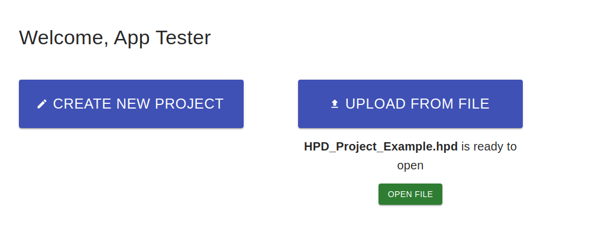

# Hydraulic Pump Design with React

Project developed with React and Material-UI from scratch. 
User interface which collects all the necessary parameters to design a hydraulic pump for the Oil & Gas industry. 

This project is in continuous development process.

### HPD API:
The application consumes an API created with **Java 17**, the Spring Framework (**Spring Boot 2.5.3**) and Hibernate,
which hosts a remote **MariaDB** database.

It exposes Spring Data Repositories over REST via **Spring Data REST**.

#### Security:
The API is protected by **Spring Security** and uses **JSON Web Tokens** in the HTTP responses for a secure connection 
with the user interface.

### Deployment:
This project has been deployed with Docker in an Ubuntu 20 server.

### Technologies and tools:
`The app was developed using:` Webstorm, GitHub, React, Redux, React Router, React Swipeable Views, Material-UI,
Recharts.

`The API was developed using:` IntelliJ, GitHub, Maven, Spring Boot, Spring Data REST, Spring Security, Jasyp, 
JSON Web Tokens, MariaDB, Spring Data JPA, Hibernate, JUnit5, Mockito Lombok, Jackson, Swagger UI.

### How to try the app:
[CLICK HERE](https://hpd-app.phi-rms.com/) **to visit the live application.**

**Use the credentials to login:**
`user: tester` , 
`password: Apptester.2022`

[CLICK HERE](https://fv2-3.failiem.lv/down.php?cf&i=htzysn8zj&n=HPD_Project_Example.hpd) **to download a project example file**

Select **Upload From File**, and upload the previously downloaded file:

## Available Scripts

In the project directory, you can run:

### `npm start`

Runs the app in the development mode.\
Open [http://localhost:3000](http://localhost:3000) to view it in the browser.

The page will reload if you make edits.\
You will also see any lint errors in the console.

### `npm run build`

Builds the app for production to the `build` folder.\
It correctly bundles React in production mode and optimizes the build for the best performance.

The build is minified and the filenames include the hashes.\

